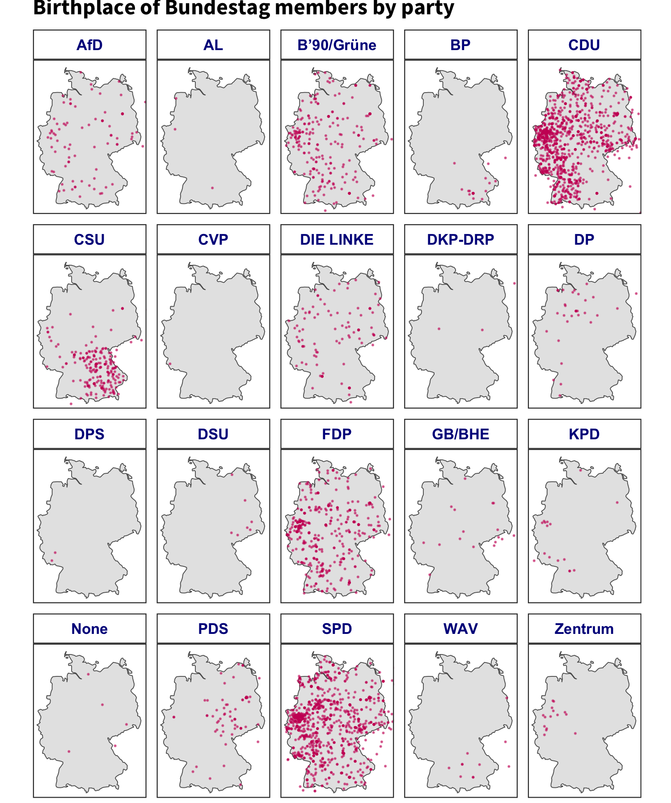

<p>
<b style="color:#cc0065">legislatoR</b> is a package for the software environment R that facilitates access to the Comparative Legislators Database (CLD). The package is available through CRAN and GitHub. To install the package from CRAN, type:
</p>

```r
install.packages("legislatoR")
```


<p> You can also download the development version directly from Github:</p>

```r
#install.packages("devtools")
devtools::install_github("saschagobel/legislatoR")
```

<hr>

<h3>Usage</h3>
<p>A working Internet connection is required to access the <b style="color:#cc0065">CLD</b> in R. This is because the data are stored online and not installed together with the package. The package provides table-specific function calls. These functions are named after the respective table and preceded by <code>legislatoR::get_</code>. To fetch the Core table, use the <code>legislatoR::get_core()</code> function, for the Political table, use the <code>legislatoR::get_political()</code> function. Call the package help file via <code>?legislatoR()</code> to get an overview of all function calls. Tables are legislature-specific, so a letter country code must be passed as an argument to the function. Here is a breakdown of all country codes. You can also call the <code>legislatoR::cld_content()</code> function to get an overview of the CLD's scope and valid country codes.</p>

<div>
<table>
<thead>
<tr>
<th>Legislature</th>
<th align="center">Code</th>
<th>Legislature</th>
<th align="center">Code</th>
<th>Legislature</th>
<th align="center">Code</th>
</tr>
</thead>
<tbody>
<tr>
<td>Austrian Nationalrat</td>
<td align="center"><code>aut</code></td>
<td>German Bundestag</td>
<td align="center"><code>deu</code></td>
<td>UK House of Commons</td>
<td align="center"><code>gbr</code></td>
</tr>
<tr>
<td>Canadian House of Commons</td>
<td align="center"><code>can</code></td>
<td>Irish Dail</td>
<td align="center"><code>irl</code></td>
<td>United States Congress</td>
<td align="center"><code>usa_house</code>/<br><code>usa_senate</code></td>
</tr>
<tr>
<td>Czech Poslanecka Snemovna</td>
<td align="center"><code>cze</code></td>
<td>Scottish Parliament</td>
<td align="center"><code>sco</code></td>
<td></td>
<td align="center"></td>
</tr>
<tr>
<td>French Assemblée</td>
<td align="center"><code>fra</code></td>
<td>Spanish Congreso</td>
<td align="center"><code>esp</code></td>
<td></td>
<td align="center"></td>
</tr>
</tbody>
</table>
</div>

<hr>

<h3>Working with the <code>legislatoR</code> package in R</h3>

<p>The <b style="color:#cc0065">legislatoR</b> package provides an easy-to-use interface to the <b style="color:#cc0065">CLD</b> in R. This brief tutorial will present two use-cases to illustrate how to engage the different tables of the database to extract information for analyses. To be precise, we will:
<br>
<ul>
<li>explore the distribution of seats in the U.S. Senate during the 116th United States Congress (Jan 2019 - Jan 2021)</li>
<li>map the birthplaces of all the members of the Bundestag by political party</li>
</ul>

The first step will be loading the libraries in R. We will employ a series of packages for data manipulation and visualization. If it is the first time you are using one of these packages, you will need to install them.</p>

```r
# load the libraries
library(legislatoR)
library(dplyr) #data manipulation
library(ggplot2) #data visualization
library(ggtext) #text aesthetics in ggplot2
library(ggpol) #geom_parliament() (parliament plots)
library(sf) #spatial vector encodings in R
library(rnaturalearth) #natural earth map data
library(rnaturalearthdata) #natural earth map data

set.seed(1310) # to get consistent results from randomization
```

<hr>

<h4>The U.S. Senate during the 116th United States Congress</h4>
<p>The <em class = "text-cld-blue">Core</em> table is at the center of the database structure. This table contains basic demographic information about the legislators, in addition to the joining keys: <span style = "color:#cc0065">Wikipedia page ID</span> (<code>pageid</code>) and the <span style = "color:#cc0065">Wikidata ID</span> (<code>wikidataid</code>). These data can be retrieved through the <code>get_core()</code> call function. The call functions take the legislature code as an argument (i.e., <code>get_*(legislature="code")</code>). Each table can be called independently based on the use-case and can be linked through one of the joining keys.</p>

```r
# load US Senate core
legislatoR::get_core(legislature = "usa_senate") %>%
dplyr::sample_n(10) #get ten random entries
```


<div data-pagedtable>
<script data-pagedtable-source type="application/json">

{"columns":[{"label":["country"],"name":[1],"type":["chr"],"align":["left"]},{"label":["pageid"],"name":[2],"type":["chr"],"align":["left"]},{"label":["wikidataid"],"name":[3],"type":["chr"],"align":["left"]},{"label":["wikititle"],"name":[4],"type":["chr"],"align":["left"]},{"label":["name"],"name":[5],"type":["chr"],"align":["left"]},{"label":["sex"],"name":[6],"type":["chr"],"align":["left"]},{"label":["ethnicity"],"name":[7],"type":["chr"],"align":["left"]},{"label":["religion"],"name":[8],"type":["chr"],"align":["left"]},{"label":["birth"],"name":[9],"type":["dttm"],"align":["right"]},{"label":["death"],"name":[10],"type":["dttm"],"align":["right"]},{"label":["birthplace"],"name":[11],"type":["chr"],"align":["left"]},{"label":["deathplace"],"name":[12],"type":["chr"],"align":["left"]}],"data":[{"1":"USA-S","2":"733034","3":"Q1807209","4":"Jim_Sasser","5":"Jim Sasser","6":"male","7":"white","8":"NA","9":"1936-09-30","10":"<NA>","11":"35.1175,-89.97111","12":"NA"},{"1":"USA-S","2":"5146576","3":"Q1339780","4":"John_S._Wells","5":"John S. Wells","6":"male","7":"white","8":"NA","9":"1803-10-18","10":"1860-08-01","11":"43.13389,-70.92639","12":"42.98139,-70.94778"},{"1":"USA-S","2":"5109901","3":"Q2299278","4":"Solomon_W._Downs","5":"Solomon W. Downs","6":"male","7":"white","8":"NA","9":"1801-01-01","10":"1854-08-14","11":"36.5,-87.38","12":"37.46,-84.66"},{"1":"USA-S","2":"2147568","3":"Q881113","4":"John_Pastore","5":"John O. Pastore","6":"male","7":"white","8":"catholicism","9":"1907-03-17","10":"2000-07-15","11":"41.83083,-71.415","12":"41.78333,-71.44167"},{"1":"USA-S","2":"2322813","3":"Q369493","4":"Timothy_O._Howe","5":"Timothy O. Howe","6":"male","7":"white","8":"NA","9":"1816-02-24","10":"1883-03-25","11":"44.38389,-70.24917","12":"38.895,-77.03667"},{"1":"USA-S","2":"2572587","3":"Q1967282","4":"J._Frank_Allee","5":"J. Frank Allee","6":"male","7":"white","8":"NA","9":"1857-12-02","10":"1938-10-12","11":"39.16194,-75.52667","12":"39.16194,-75.52667"},{"1":"USA-S","2":"871727","3":"Q1244777","4":"James_L._Buckley","5":"James L. Buckley","6":"male","7":"white","8":"NA","9":"1923-03-09","10":"<NA>","11":"40.67,-73.94","12":"NA"},{"1":"USA-S","2":"1102476","3":"Q359294","4":"John_J._McRae","5":"John J. McRae","6":"male","7":"white","8":"NA","9":"1815-01-10","10":"1868-05-31","11":"34.81333,-79.97583","12":"17.49861,-88.18861"},{"1":"USA-S","2":"4856982","3":"Q2158142","4":"Robert_M._Charlton","5":"Robert M. Charlton","6":"male","7":"white","8":"NA","9":"1807-01-19","10":"1854-01-18","11":"32.05083,-81.10389","12":"32.05083,-81.10389"},{"1":"USA-S","2":"1279245","3":"Q453709","4":"Sheila_Frahm","5":"Sheila Frahm","6":"female","7":"white","8":"NA","9":"1945-03-22","10":"<NA>","11":"39.3922,-101.048","12":"NA"}],"options":{"columns":{"min":{},"max":[10]},"rows":{"min":[10],"max":[10]},"pages":{}}}
</script>
</div>


<hr>

<p>In this case, we will employ <em class = "text-cld-blue">Political</em> table to derive the counts of the seats each party held:</p>

```r
# load US Senate political table for the 116th Congress
us_senate_political <- legislatoR::get_political(legislature = "usa_senate") %>%
dplyr::filter(session == 116) #filter only legislators from the 116th Congress

dplyr::sample_n(us_senate_political, 10) #print ten random entries
```

<div data-pagedtable>
<script data-pagedtable-source type="application/json">
{"columns":[{"label":["pageid"],"name":[1],"type":["chr"],"align":["left"]},{"label":["session"],"name":[2],"type":["dbl"],"align":["right"]},{"label":["party"],"name":[3],"type":["chr"],"align":["left"]},{"label":["constituency"],"name":[4],"type":["chr"],"align":["left"]},{"label":["session_start"],"name":[5],"type":["date"],"align":["right"]},{"label":["session_end"],"name":[6],"type":["date"],"align":["right"]},{"label":["service"],"name":[7],"type":["int"],"align":["right"]},{"label":["senate_majority"],"name":[8],"type":["lgl"],"align":["right"]},{"label":["senate_president"],"name":[9],"type":["lgl"],"align":["right"]},{"label":["senate_president_pro_tempore"],"name":[10],"type":["lgl"],"align":["right"]},{"label":["senate_president_pro_tempore_emeritus"],"name":[11],"type":["lgl"],"align":["right"]},{"label":["senate_permanent_acting_president_pro_tempore"],"name":[12],"type":["lgl"],"align":["right"]},{"label":["senate_deputy_president_pro_tempore"],"name":[13],"type":["lgl"],"align":["right"]},{"label":["senate_republican_conference_chair"],"name":[14],"type":["lgl"],"align":["right"]},{"label":["senate_republican_conference_vice_chair"],"name":[15],"type":["lgl"],"align":["right"]},{"label":["senate_democratic_conference_chair"],"name":[16],"type":["lgl"],"align":["right"]},{"label":["senate_democratic_conference_vice_chair"],"name":[17],"type":["lgl"],"align":["right"]},{"label":["senate_democratic_caucus_chair"],"name":[18],"type":["lgl"],"align":["right"]},{"label":["senate_democratic_caucus_vice_chair"],"name":[19],"type":["lgl"],"align":["right"]},{"label":["senate_democratic_caucus_secretary"],"name":[20],"type":["lgl"],"align":["right"]},{"label":["senate_democratic_conference_secretary"],"name":[21],"type":["lgl"],"align":["right"]},{"label":["senate_republican_conference_secretary"],"name":[22],"type":["lgl"],"align":["right"]},{"label":["senate_senatorial_committee_chair"],"name":[23],"type":["lgl"],"align":["right"]},{"label":["senate_national_senatorial_committee_chair"],"name":[24],"type":["lgl"],"align":["right"]},{"label":["senate_policy_committee_chair"],"name":[25],"type":["lgl"],"align":["right"]},{"label":["senate_republican_policy_committee_chair"],"name":[26],"type":["lgl"],"align":["right"]},{"label":["senate_democratic_policy_committee_chair"],"name":[27],"type":["lgl"],"align":["right"]},{"label":["senate_democratic_policy_committee_vice_chair"],"name":[28],"type":["lgl"],"align":["right"]},{"label":["senate_democratic_steering_outreach_committee_chair"],"name":[29],"type":["lgl"],"align":["right"]},{"label":["senate_democratic_steering_outreach_committee_vice_chair"],"name":[30],"type":["lgl"],"align":["right"]},{"label":["senate_democratic_steering_committee_chair"],"name":[31],"type":["lgl"],"align":["right"]},{"label":["senate_democratic_committee_outreach_chair"],"name":[32],"type":["lgl"],"align":["right"]},{"label":["senate_democratic_rural_outreach_chair"],"name":[33],"type":["lgl"],"align":["right"]},{"label":["senate_republican_conference_secretary__1"],"name":[34],"type":["chr"],"align":["left"]},{"label":["senate_republican_campaign_committee_chair"],"name":[35],"type":["lgl"],"align":["right"]},{"label":["senate_democratic_campaign_committee_chair"],"name":[36],"type":["lgl"],"align":["right"]},{"label":["senate_majority_leader"],"name":[37],"type":["lgl"],"align":["right"]},{"label":["senate_majority_whip"],"name":[38],"type":["lgl"],"align":["right"]},{"label":["senate_chief_deputy_whip"],"name":[39],"type":["lgl"],"align":["right"]},{"label":["senate_majority_deputy_whips"],"name":[40],"type":["lgl"],"align":["right"]},{"label":["senate_minority_leader"],"name":[41],"type":["lgl"],"align":["right"]},{"label":["senate_counselor_to_minority_leader"],"name":[42],"type":["lgl"],"align":["right"]},{"label":["senate_minority_assistant_leader"],"name":[43],"type":["lgl"],"align":["right"]},{"label":["senate_minority_whip"],"name":[44],"type":["lgl"],"align":["right"]},{"label":["senate_minority_deputy_whip"],"name":[45],"type":["lgl"],"align":["right"]},{"label":["senate_republican_conference_secretary_1"],"name":[46],"type":["lgl"],"align":["right"]}],"data":[{"1":"1461855","2":"116","3":"D","4":"Virginia","5":"2019-01-03","6":"2021-01-03","7":"731","8":"FALSE","9":"FALSE","10":"FALSE","11":"FALSE","12":"NA","13":"NA","14":"FALSE","15":"FALSE","16":"NA","17":"NA","18":"FALSE","19":"FALSE","20":"FALSE","21":"NA","22":"NA","23":"NA","24":"NA","25":"FALSE","26":"FALSE","27":"FALSE","28":"NA","29":"NA","30":"NA","31":"FALSE","32":"FALSE","33":"NA","34":"NA","35":"FALSE","36":"FALSE","37":"FALSE","38":"FALSE","39":"FALSE","40":"NA","41":"FALSE","42":"NA","43":"FALSE","44":"FALSE","45":"NA","46":"NA"},{"1":"335844","2":"116","3":"D","4":"Michigan","5":"2019-01-03","6":"2021-01-03","7":"731","8":"FALSE","9":"FALSE","10":"FALSE","11":"FALSE","12":"NA","13":"NA","14":"FALSE","15":"FALSE","16":"NA","17":"NA","18":"FALSE","19":"FALSE","20":"FALSE","21":"NA","22":"NA","23":"NA","24":"NA","25":"FALSE","26":"FALSE","27":"FALSE","28":"NA","29":"NA","30":"NA","31":"FALSE","32":"FALSE","33":"NA","34":"NA","35":"FALSE","36":"FALSE","37":"FALSE","38":"FALSE","39":"FALSE","40":"NA","41":"FALSE","42":"NA","43":"FALSE","44":"FALSE","45":"NA","46":"NA"},{"1":"959147","2":"116","3":"D","4":"Connecticut","5":"2019-01-03","6":"2021-01-03","7":"731","8":"FALSE","9":"FALSE","10":"FALSE","11":"FALSE","12":"NA","13":"NA","14":"FALSE","15":"FALSE","16":"NA","17":"NA","18":"FALSE","19":"FALSE","20":"FALSE","21":"NA","22":"NA","23":"NA","24":"NA","25":"FALSE","26":"FALSE","27":"FALSE","28":"NA","29":"NA","30":"NA","31":"FALSE","32":"FALSE","33":"NA","34":"NA","35":"FALSE","36":"FALSE","37":"FALSE","38":"FALSE","39":"FALSE","40":"NA","41":"FALSE","42":"NA","43":"FALSE","44":"FALSE","45":"NA","46":"NA"},{"1":"496707","2":"116","3":"Independent","4":"Maine","5":"2019-01-03","6":"2021-01-03","7":"731","8":"FALSE","9":"FALSE","10":"FALSE","11":"FALSE","12":"NA","13":"NA","14":"FALSE","15":"FALSE","16":"NA","17":"NA","18":"FALSE","19":"FALSE","20":"FALSE","21":"NA","22":"NA","23":"NA","24":"NA","25":"FALSE","26":"FALSE","27":"FALSE","28":"NA","29":"NA","30":"NA","31":"FALSE","32":"FALSE","33":"NA","34":"NA","35":"FALSE","36":"FALSE","37":"FALSE","38":"FALSE","39":"FALSE","40":"NA","41":"FALSE","42":"NA","43":"FALSE","44":"FALSE","45":"NA","46":"NA"},{"1":"850170","2":"116","3":"R","4":"North Carolina","5":"2019-01-03","6":"2021-01-03","7":"731","8":"TRUE","9":"FALSE","10":"FALSE","11":"FALSE","12":"NA","13":"NA","14":"FALSE","15":"FALSE","16":"NA","17":"NA","18":"FALSE","19":"FALSE","20":"FALSE","21":"NA","22":"NA","23":"NA","24":"NA","25":"FALSE","26":"FALSE","27":"FALSE","28":"NA","29":"NA","30":"NA","31":"FALSE","32":"FALSE","33":"NA","34":"NA","35":"FALSE","36":"FALSE","37":"FALSE","38":"FALSE","39":"FALSE","40":"NA","41":"FALSE","42":"NA","43":"FALSE","44":"FALSE","45":"NA","46":"NA"},{"1":"16180456","2":"116","3":"R","4":"Mississippi","5":"2019-01-03","6":"2021-01-03","7":"731","8":"TRUE","9":"FALSE","10":"FALSE","11":"FALSE","12":"NA","13":"NA","14":"FALSE","15":"FALSE","16":"NA","17":"NA","18":"FALSE","19":"FALSE","20":"FALSE","21":"NA","22":"NA","23":"NA","24":"NA","25":"FALSE","26":"FALSE","27":"FALSE","28":"NA","29":"NA","30":"NA","31":"FALSE","32":"FALSE","33":"NA","34":"NA","35":"FALSE","36":"FALSE","37":"FALSE","38":"FALSE","39":"FALSE","40":"NA","41":"FALSE","42":"NA","43":"FALSE","44":"FALSE","45":"NA","46":"NA"},{"1":"13396981","2":"116","3":"D","4":"New Hampshire","5":"2019-01-03","6":"2021-01-03","7":"731","8":"FALSE","9":"FALSE","10":"FALSE","11":"FALSE","12":"NA","13":"NA","14":"FALSE","15":"FALSE","16":"NA","17":"NA","18":"FALSE","19":"FALSE","20":"FALSE","21":"NA","22":"NA","23":"NA","24":"NA","25":"FALSE","26":"FALSE","27":"FALSE","28":"NA","29":"NA","30":"NA","31":"FALSE","32":"FALSE","33":"NA","34":"NA","35":"FALSE","36":"FALSE","37":"FALSE","38":"FALSE","39":"FALSE","40":"NA","41":"FALSE","42":"NA","43":"FALSE","44":"FALSE","45":"NA","46":"NA"},{"1":"27658059","2":"116","3":"R","4":"South Carolina","5":"2019-01-03","6":"2021-01-03","7":"731","8":"TRUE","9":"FALSE","10":"FALSE","11":"FALSE","12":"NA","13":"NA","14":"FALSE","15":"FALSE","16":"NA","17":"NA","18":"FALSE","19":"FALSE","20":"FALSE","21":"NA","22":"NA","23":"NA","24":"NA","25":"FALSE","26":"FALSE","27":"FALSE","28":"NA","29":"NA","30":"NA","31":"FALSE","32":"FALSE","33":"NA","34":"NA","35":"FALSE","36":"FALSE","37":"FALSE","38":"FALSE","39":"FALSE","40":"NA","41":"FALSE","42":"NA","43":"FALSE","44":"FALSE","45":"NA","46":"NA"},{"1":"411739","2":"116","3":"R","4":"Georgia","5":"2019-01-03","6":"2021-01-03","7":"731","8":"TRUE","9":"FALSE","10":"FALSE","11":"FALSE","12":"NA","13":"NA","14":"FALSE","15":"FALSE","16":"NA","17":"NA","18":"FALSE","19":"FALSE","20":"FALSE","21":"NA","22":"NA","23":"NA","24":"NA","25":"FALSE","26":"FALSE","27":"FALSE","28":"NA","29":"NA","30":"NA","31":"FALSE","32":"FALSE","33":"NA","34":"NA","35":"FALSE","36":"FALSE","37":"FALSE","38":"FALSE","39":"FALSE","40":"NA","41":"FALSE","42":"NA","43":"FALSE","44":"FALSE","45":"NA","46":"NA"},{"1":"2600365","2":"116","3":"D","4":"Rhode Island","5":"2019-01-03","6":"2021-01-03","7":"731","8":"FALSE","9":"FALSE","10":"FALSE","11":"FALSE","12":"NA","13":"NA","14":"FALSE","15":"FALSE","16":"NA","17":"NA","18":"FALSE","19":"FALSE","20":"FALSE","21":"NA","22":"NA","23":"NA","24":"NA","25":"FALSE","26":"FALSE","27":"FALSE","28":"NA","29":"NA","30":"NA","31":"FALSE","32":"FALSE","33":"NA","34":"NA","35":"FALSE","36":"FALSE","37":"FALSE","38":"FALSE","39":"FALSE","40":"NA","41":"FALSE","42":"NA","43":"FALSE","44":"FALSE","45":"NA","46":"NA"}],"options":{"columns":{"min":{},"max":[10]},"rows":{"min":[10],"max":[10]},"pages":{}}}
</script>
</div>

<p>You can employ <code>dplyr</code> verbs to extract the seat counts per party and generate a visual illustration of the distribution:</p>

```r
# get the seat counts per party for parliament plot
us_senate_counts <- us_senate_political %>%
dplyr::group_by(party) %>% #nest at party
dplyr::summarize(seats = n()) %>% #generate counts
dplyr::mutate(colors = dplyr::case_when(party == "D" ~ "#3885D3",
party == "R" ~ "#E02E44",
party == "Independent" ~ "#637684")) #assign party colors for visualization

us_senate_counts
```

<div data-pagedtable="false">
<script data-pagedtable-source type="application/json">
{"columns":[{"label":["party"],"name":[1],"type":["chr"],"align":["left"]},{"label":["seats"],"name":[2],"type":["int"],"align":["right"]},{"label":["colors"],"name":[3],"type":["chr"],"align":["left"]}],"data":[{"1":"D","2":"45","3":"#3885D3"},{"1":"Independent","2":"2","3":"#637684"},{"1":"R","2":"53","3":"#E02E44"}],"options":{"columns":{"min":{},"max":[10]},"rows":{"min":[10],"max":[10]},"pages":{}}}
</script>
</div>

<p>We can use the <code>us_senate_counts</code> data frame as the input for our plot:</p>

```r
# a caption with some md formating
caption_plot <- paste0("The 116th US Senate was controlled by the <b style='color:#E02E44'&gt Republican party</b&gt with <b style='color:#E02E44'&gt",
us_senate_counts$seats[us_senate_counts$party == "R"], # Number of Republican seats
" seats</b&gt.<br&gtThe <b style='color:#3885D3'&gtDemocratric party</b&gt held <b style='color:#3885D3'&gt",
us_senate_counts$seats[us_senate_counts$party == "D"], # Number of Democrat seats
" seats</b&gt. The <b style='color:#637684'&gt",
us_senate_counts$seats[us_senate_counts$party == "Independent"], # Number of Independent seats
" Independents </b&gtcaucased with the Democrats."
)

# plot parliament seats
ggplot(us_senate_counts) +
ggpol::geom_parliament(aes(seats = seats, fill = party), color = "black") +
scale_fill_manual(values = us_senate_counts$colors, labels = us_senate_counts$party) +
coord_fixed() +
labs(title = "<b&gtUS Senate membership (116th Congress)</b&gt",
caption = caption_plot) +
theme_void() +
theme(legend.position = "none",
plot.title = ggtext::element_markdown(),
plot.caption = ggtext::element_markdown())
```


<hr>

<h4>The birthplaces of German parlimentarians</h4>
<p>In most instances, you will need to link information from different tables in the database. For instance, in this case we need the parliamentarians' birthplace coordinates and their political party. These two data points are in the <em class = "text-cld-blue">Core</em> and <em class = "text-cld-blue">Political</em> tables. One easy way to link the tables is by employing <code>dplyr</code> joins.</p>

```r
# assign Political and Core tables to the environment
deu_politicians <- dplyr::left_join(x = legislatoR::get_political(legislature = "deu"),
y = legislatoR::get_core(legislature = "deu"),
by = "pageid") #these two tables can be joined through their Wikipedia page ID

head(deu_politicians) #print first couple observations
```

<div data-pagedtable="false">
<script data-pagedtable-source type="application/json">
{"columns":[{"label":[""],"name":["_rn_"],"type":[""],"align":["left"]},{"label":["country"],"name":[1],"type":["chr"],"align":["left"]},{"label":["pageid"],"name":[2],"type":["chr"],"align":["left"]},{"label":["wikidataid"],"name":[3],"type":["chr"],"align":["left"]},{"label":["wikititle"],"name":[4],"type":["chr"],"align":["left"]},{"label":["name"],"name":[5],"type":["chr"],"align":["left"]},{"label":["sex"],"name":[6],"type":["chr"],"align":["left"]},{"label":["ethnicity"],"name":[7],"type":["chr"],"align":["left"]},{"label":["religion"],"name":[8],"type":["chr"],"align":["left"]},{"label":["birth"],"name":[9],"type":["dttm"],"align":["right"]},{"label":["death"],"name":[10],"type":["dttm"],"align":["right"]},{"label":["birthplace"],"name":[11],"type":["chr"],"align":["left"]},{"label":["deathplace"],"name":[12],"type":["chr"],"align":["left"]}],"data":[{"1":"DEU","2":"2657","3":"Q2492","4":"Konrad_Adenauer","5":"Konrad Adenauer","6":"male","7":"white","8":"catholicism","9":"1876-01-05","10":"1967-04-19","11":"50.94222,6.95778","12":"50.6595,7.21282","_rn_":"1"},{"1":"DEU","2":"171955","3":"Q100613","4":"Willi_Agatz","5":"Willi Agatz","6":"male","7":"NA","8":"NA","9":"1904-01-01","10":"1957-01-01","11":"51.45083,7.01306","12":"52.51667,13.38333","_rn_":"2"},{"1":"DEU","2":"171957","3":"Q360721","4":"Adolf_Ahrens_(Kapitän)","5":"Adolf Ahrens","6":"male","7":"NA","8":"protestantism evangelical","9":"1879-09-17","10":"1957-01-21","11":"53.5364,8.60056","12":"53.07694,8.80889","_rn_":"3"},{"1":"DEU","2":"171967","3":"Q1382213","4":"Johannes_Albers","5":"Johannes Albers","6":"male","7":"NA","8":"catholicism","9":"1890-03-08","10":"1963-03-08","11":"51.2,6.43333","12":"50.94222,6.95778","_rn_":"4"},{"1":"DEU","2":"172061","3":"Q1277445","4":"Luise_Albertz","5":"Luise Albertz","6":"female","7":"NA","8":"NA","9":"1901-06-22","10":"1979-02-01","11":"51.43222,6.76111","12":"51.55,6.85","_rn_":"5"},{"1":"DEU","2":"172064","3":"Q1394531","4":"Lisa_Albrecht","5":"Lisa Albrecht","6":"female","7":"NA","8":"NA","9":"1896-05-27","10":"1958-05-16","11":"53.55,10","12":"52.51667,13.38333","_rn_":"6"}],"options":{"columns":{"min":{},"max":[10]},"rows":{"min":[10],"max":[10]},"pages":{}}}
</script>
</div>

<div class="alert alert-info alert-dismissible fade show" role="alert">
<strong>Since the CLD is a relational database. All tables can be joined through the Core with one of the join keys.</strong> You can see the specific variable for the join in the stucture diagram.
<button type="button" class="close" data-dismiss="alert" aria-label="Close">
<span aria-hidden="true">&times;</span>
</button>
</div>
<hr>

<p>The <code>deu_politicians</code> data frame contains all the information from the two tables. We can use these data to extract the latitudes and longitudes of the legislators' birthplace for a map.</p>

```r
# extract birthplace latitudes and longitudes with regular expressions
deu_birthplace_map_df <- deu_politicians %>%
dplyr::distinct(wikidataid, .keep_all = T) %>% # keep unique entries of legislators
dplyr::mutate(lat = stringr::str_extract(birthplace, "[-[:digit:]]{1,4}\\.[:digit:]+") %>% as.numeric(),
lon = stringr::str_extract(birthplace, "[-[:digit:]]{1,4}\\.[:digit:]+$") %>% as.numeric())

# define German boundaries
lat1 <- 47; lat2 <- 55.5 ; lon1 <- 5.5; lon2 <- 15.5

germany_sf <- rnaturalearth::ne_countries(scale = "medium", returnclass = "sf", country = "Germany") #get spatial encodings for Germany

ggplot(germany_sf) +
geom_sf(size = 1) +
geom_point(data = deu_birthplace_map_df, aes(x = lon, y = lat), size = .25,
shape = 20, color = "#cc0065", alpha = 0.5) +
theme_bw() +
facet_wrap(~party) +
coord_sf(xlim = c(lon1, lon2), ylim = c(lat1, lat2), expand = FALSE) +
labs(title = "<b>Birthplace of Bundestag members<b>")+
theme(plot.margin=grid::unit(c(0,0,0,0), "mm"),
axis.title = element_blank(),
axis.ticks = element_blank(),
axis.text=element_blank(),
panel.grid.major = element_blank(),
panel.grid.minor = element_blank(),
legend.position = "none", text = element_text(size=10),
panel.grid.minor.y =  element_blank(),
strip.background = element_rect(fill="white"),
strip.text.x = element_text(color = "darkblue", face = "bold"),
plot.title = ggtext::element_markdown(family = "Source Sans Pro"))
```


